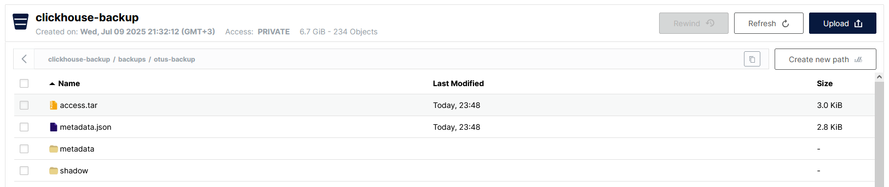

# Storage Policy и резервное копирование
## S3
Сервис minio в [docker-compose.yml](../infrastructure/docker-compose.yml)

## clickhouse-backup и storage policy
```bash
docker compose -f infrastructure/docker-compose.yml -p otus exec -t clickhouse bash
root@clickhouse:/# wget https://github.com/Altinity/clickhouse-backup/releases/download/v2.6.23/clickhouse-backup-linux-amd64.tar.gz -O /tmp/clickhouse-backup-linux-amd64.tar.gz
...
2025-07-04 14:08:36 (2.87 MB/s) - ‘/tmp/clickhouse-backup-linux-amd64.tar.gz’ saved [34809987/34809987]

root@clickhouse:/# tar -tzf /tmp/clickhouse-backup-linux-amd64.tar.gz
build/linux/amd64/clickhouse-backup
root@clickhouse:/# tar -xzf /tmp/clickhouse-backup-linux-amd64.tar.gz -C /tmp/
root@clickhouse:/# mv /tmp/build/linux/amd64/clickhouse-backup /usr/bin/
root@clickhouse:/# chmod +x /usr/bin/clickhouse-backup 
root@clickhouse:/# clickhouse-backup --version
Version:         2.6.23
Git Commit:      a9f9ce80bd355c209acfa96166a85a2ac269899c
Build Date:      2025-06-18
root@clickhouse:/# 
```
Storage policy задана в [storage-policy.xml](../infrastructure/config.d/storage-policy.xml). Доступные диски проверим в клиенте запросом:
```bash
clickhouse :) SELECT name, path,
formatReadableSize(free_space) AS free,
formatReadableSize(total_space) AS total,
formatReadableSize(keep_free_space) AS reserved
FROM system.disks;

Query id: 83b6eb5c-d442-402f-93ff-dd5bde88a0ba

   ┌─name─────┬─path───────────────────────────────┬─free──────┬─total─────┬─reserved─┐
1. │ default  │ /var/lib/clickhouse/               │ 55.74 GiB │ 95.90 GiB │ 0.00 B   │
2. │ s3_cache │ /var/lib/clickhouse/disks/s3_disk/ │ 16.00 EiB │ 16.00 EiB │ 0.00 B   │
3. │ s3_disk  │ /var/lib/clickhouse/disks/s3_disk/ │ 16.00 EiB │ 16.00 EiB │ 0.00 B   │
   └──────────┴────────────────────────────────────┴───────────┴───────────┴──────────┘

3 rows in set. Elapsed: 0.001 sec. 

clickhouse :) 
```

## Тестовая база, бэкап и восстановление
Базы были созданы в рамках прошлых занятий. Бэкап:
```bash
root@clickhouse:/# clickhouse-backup create otus-backup
2025-07-09 20:43:31.723 INF pkg/clickhouse/clickhouse.go:131 > clickhouse connection prepared: tcp://localhost:9000 run ping
2025-07-09 20:43:31.725 INF pkg/clickhouse/clickhouse.go:134 > clickhouse connection success: tcp://localhost:9000
...
2025-07-09 20:43:31.980 INF pkg/backup/create.go:363 > done duration=258ms operation=createBackupLocal version=2.6.23
2025-07-09 20:43:31.980 INF pkg/clickhouse/clickhouse.go:336 > clickhouse connection closed
root@clickhouse:/# clickhouse-backup list
2025-07-09 20:43:58.324 INF pkg/clickhouse/clickhouse.go:131 > clickhouse connection prepared: tcp://localhost:9000 run ping
2025-07-09 20:43:58.325 INF pkg/clickhouse/clickhouse.go:134 > clickhouse connection success: tcp://localhost:9000
...
2025-07-09 20:43:58.359 INF pkg/storage/general.go:163 > list_duration=2.629043
otus-backup   09/07/2025 20:43:31   local      all:6.68GiB,data:6.68GiB,arch:0B,obj:21.29KiB,meta:0B,rbac:192B,conf:0B   regular
2025-07-09 20:43:58.359 INF pkg/clickhouse/clickhouse.go:336 > clickhouse connection closed
root@clickhouse:/# clickhouse-backup upload otus-backup
2025-07-09 20:48:09.835 INF pkg/clickhouse/clickhouse.go:131 > clickhouse connection prepared: tcp://localhost:9000 run ping
2025-07-09 20:48:09.837 INF pkg/clickhouse/clickhouse.go:134 > clickhouse connection success: tcp://localhost:9000
...
2025-07-09 20:48:09.928 INF pkg/backup/upload.go:184 > done data_size=1.87MiB duration=49ms metadata_size=458B operation=upload_table progress=1/28 table=imdb.genres version=2.6.23
2025-07-09 20:48:10.161 INF pkg/backup/upload.go:184 > done data_size=7.57MiB duration=283ms metadata_size=562B operation=upload_table progress=3/28 table=tpch.supplier version=2.6.23
2025-07-09 20:48:10.210 INF pkg/backup/upload.go:184 > done data_size=18.00KiB duration=282ms metadata_size=589B operation=upload_table progress=4/28 table=default.tbl1 version=2.6.23
2025-07-09 20:48:10.218 INF pkg/backup/upload.go:184 > done data_size=0B duration=57ms metadata_size=516B operation=upload_table progress=5/28 table=default.sales version=2.6.23
2025-07-09 20:48:10.262 INF pkg/backup/upload.go:184 > done data_size=9.00KiB duration=52ms metadata_size=499B operation=upload_table progress=6/28 table=default.tbl3 version=2.6.23
2025-07-09 20:48:10.331 INF pkg/backup/upload.go:184 > done data_size=22.00KiB duration=112ms metadata_size=589B operation=upload_table progress=7/28 table=default.tbl4 version=2.6.23
2025-07-09 20:48:10.372 INF pkg/backup/upload.go:184 > done data_size=11.00KiB duration=109ms metadata_size=551B operation=upload_table progress=8/28 table=default.tbl5 version=2.6.23
2025-07-09 20:48:10.416 INF pkg/backup/upload.go:184 > done data_size=18.00KiB duration=85ms metadata_size=584B operation=upload_table progress=9/28 table=default.tbl6 version=2.6.23
2025-07-09 20:48:10.540 INF pkg/backup/upload.go:184 > done data_size=613.68MiB duration=661ms metadata_size=821B operation=upload_table progress=2/28 table=tpch.orders version=2.6.23
2025-07-09 20:48:10.546 INF pkg/backup/upload.go:184 > done data_size=18.22MiB duration=175ms metadata_size=570B operation=upload_table progress=10/28 table=default.transactions version=2.6.23
2025-07-09 20:48:10.547 INF pkg/backup/upload.go:184 > done data_size=18.00KiB duration=131ms metadata_size=541B operation=upload_table progress=11/28 table=default.user_actions version=2.6.23
2025-07-09 20:48:10.557 INF pkg/backup/upload.go:184 > done data_size=0B duration=17ms metadata_size=412B operation=upload_table progress=12/28 table=default.user_activity version=2.6.23
2025-07-09 20:48:10.561 INF pkg/backup/upload.go:184 > done data_size=23.00KiB duration=14ms metadata_size=614B operation=upload_table progress=13/28 table=default.sales_agg version=2.6.23
2025-07-09 20:48:10.567 INF pkg/backup/upload.go:184 > done data_size=9.00KiB duration=19ms metadata_size=468B operation=upload_table progress=14/28 table=tpch.region version=2.6.23
2025-07-09 20:48:10.572 INF pkg/backup/upload.go:184 > done data_size=9.00KiB duration=15ms metadata_size=440B operation=upload_table progress=15/28 table=default.tbl2 version=2.6.23
2025-07-09 20:48:10.614 INF pkg/backup/upload.go:184 > done data_size=7.80MiB duration=53ms metadata_size=491B operation=upload_table progress=16/28 table=imdb.movies version=2.6.23
2025-07-09 20:48:10.622 INF pkg/backup/upload.go:184 > done data_size=9.50KiB duration=50ms metadata_size=924B operation=upload_table progress=18/28 table=restaurant.menu version=2.6.23
2025-07-09 20:48:10.694 INF pkg/backup/upload.go:184 > done data_size=42.24MiB duration=127ms metadata_size=516B operation=upload_table progress=17/28 table=imdb.roles version=2.6.23
2025-07-09 20:48:11.098 INF pkg/backup/upload.go:184 > done data_size=121.90MiB duration=484ms metadata_size=652B operation=upload_table progress=19/28 table=tpch.customer version=2.6.23
2025-07-09 20:48:17.382 INF pkg/backup/upload.go:184 > done data_size=2.67GiB duration=6.76s metadata_size=1015B operation=upload_table progress=20/28 table=tpch.lineitem version=2.6.23
2025-07-09 20:48:19.027 INF pkg/backup/upload.go:184 > done data_size=447.31MiB duration=7.929s metadata_size=678B operation=upload_table progress=22/28 table=tpch.partsupp version=2.6.23
2025-07-09 20:48:19.053 INF pkg/backup/upload.go:184 > done data_size=10.50KiB duration=1.67s metadata_size=490B operation=upload_table progress=23/28 table=tpch.nation version=2.6.23
2025-07-09 20:48:19.148 INF pkg/backup/upload.go:184 > done data_size=9.48MiB duration=121ms metadata_size=520B operation=upload_table progress=24/28 table=imdb.actors version=2.6.23
2025-07-09 20:48:19.488 INF pkg/backup/upload.go:184 > done data_size=89.70MiB duration=436ms metadata_size=654B operation=upload_table progress=25/28 table=tpch.part version=2.6.23
2025-07-09 20:48:19.496 INF pkg/backup/upload.go:184 > done data_size=0B duration=348ms metadata_size=656B operation=upload_table progress=26/28 table=tpch.lineitem_partitioned_mv version=2.6.23
2025-07-09 20:48:19.507 INF pkg/backup/upload.go:184 > done data_size=0B duration=18ms metadata_size=470B operation=upload_table progress=27/28 table=default.sales_mv version=2.6.23
2025-07-09 20:48:19.519 INF pkg/backup/upload.go:184 > done data_size=0B duration=24ms metadata_size=377B operation=upload_table progress=28/28 table=default.users_dict version=2.6.23
2025-07-09 20:48:20.181 INF pkg/backup/upload.go:184 > done data_size=2.69GiB duration=9.487s metadata_size=13.65KiB operation=upload_table progress=21/28 table=tpch.lineitem_partitioned version=2.6.23
2025-07-09 20:48:20.189 INF pkg/backup/upload.go:256 > done backup=otus-backup duration=10.354s object_disk_size=0B operation=upload upload_size=6.69GiB version=2.6.23
2025-07-09 20:48:20.189 INF pkg/clickhouse/clickhouse.go:336 > clickhouse connection closed
root@clickhouse:/# 
```
Файлы бэкапа лежат в минио:


"Случайно" очистим tpch.orders:
```bash
clickhouse :) SELECT count(1) FROM tpch.orders;

   ┌─count(1)─┐
1. │ 15000000 │ -- 15.00 million
   └──────────┘

1 row in set. Elapsed: 0.002 sec. 

clickhouse :) TRUNCATE tpch.orders;

Ok.

0 rows in set. Elapsed: 0.005 sec. 

clickhouse :) SELECT count(1) FROM tpch.orders;

   ┌─count(1)─┐
1. │        0 │
   └──────────┘

1 row in set. Elapsed: 0.003 sec. 

clickhouse :) 
```
Восстановим таблицу из бэкапа:
```bash
root@clickhouse:/# clickhouse-backup restore otus-backup -t tpch.orders
2025-07-09 20:58:47.920 INF pkg/clickhouse/clickhouse.go:131 > clickhouse connection prepared: tcp://localhost:9000 run ping
2025-07-09 20:58:47.922 INF pkg/clickhouse/clickhouse.go:134 > clickhouse connection success: tcp://localhost:9000
...
2025-07-09 20:58:47.961 INF pkg/clickhouse/clickhouse.go:1170 > DROP TABLE IF EXISTS `tpch`.`orders` NO DELAY
2025-07-09 20:58:47.963 INF pkg/clickhouse/clickhouse.go:1170 > CREATE DATABASE IF NOT EXISTS `tpch` ENGINE=Atomic
2025-07-09 20:58:47.963 INF pkg/clickhouse/clickhouse.go:1170 > CREATE TABLE tpch.orders UUID '764b80d3-3490-4068-ba4f-d12236bc1a12' (`o_orderkey` Int32, `o_custkey` Int32, `o_orderstatus` String, `o_totalprice` Decimal(15, 2), `o_orderdate` Date, `o_orderpriority` String, `o_clerk` String, `o_shippriority` Int32, `o_comment` String) ENGINE = MergeTree ORDER BY o_orderkey SETTINGS index_granularity = 8192
2025-07-09 20:58:47.966 INF pkg/backup/restore.go:954 > done backup=otus-backup duration=5ms operation=restore_schema
...
2025-07-09 20:58:48.002 INF pkg/backup/restore.go:1513 > download object_disks start table=tpch.orders
2025-07-09 20:58:48.002 INF pkg/backup/restore.go:1520 > download object_disks finish duration=0s size=0B
2025-07-09 20:58:48.002 INF pkg/clickhouse/clickhouse.go:1170 > ALTER TABLE `tpch`.`orders` ATTACH PART 'all_1_6_1'
2025-07-09 20:58:48.004 INF pkg/clickhouse/clickhouse.go:1170 > ALTER TABLE `tpch`.`orders` ATTACH PART 'all_7_12_1'
2025-07-09 20:58:48.007 INF pkg/clickhouse/clickhouse.go:1170 > ALTER TABLE `tpch`.`orders` ATTACH PART 'all_13_13_0'
2025-07-09 20:58:48.010 INF pkg/clickhouse/clickhouse.go:1170 > ALTER TABLE `tpch`.`orders` ATTACH PART 'all_14_14_0'
2025-07-09 20:58:48.011 INF pkg/backup/restore.go:1473 > done database=tpch duration=11ms operation=restoreDataRegular progress=1/1 table=orders
2025-07-09 20:58:48.011 INF pkg/backup/restore.go:1385 > done backup=otus-backup duration=45ms operation=restore_data
2025-07-09 20:58:48.012 INF pkg/clickhouse/clickhouse.go:1170 > DROP FUNCTION IF EXISTS `transactionTotal`
2025-07-09 20:58:48.013 INF pkg/clickhouse/clickhouse.go:1170 > CREATE OR REPLACE FUNCTION transactionTotal AS (a, b) -> multiplyDecimal(toDecimal64(a, 0), toDecimal64(b, 2))
2025-07-09 20:58:48.014 INF pkg/clickhouse/clickhouse.go:1170 > DROP FUNCTION IF EXISTS `transactionCategory`
2025-07-09 20:58:48.014 INF pkg/clickhouse/clickhouse.go:1170 > CREATE OR REPLACE FUNCTION transactionCategory AS (a, b) -> if(transactionTotal(a, b) > 600000000, 'wow', 'meh')
2025-07-09 20:58:48.015 INF pkg/backup/restore.go:259 > done duration=95ms operation=restore version=2.6.23
2025-07-09 20:58:48.015 INF pkg/clickhouse/clickhouse.go:336 > clickhouse connection closed
root@clickhouse:/#
```
Проверим:
```bash
clickhouse :) SELECT count(1) FROM tpch.orders;

   ┌─count(1)─┐
1. │ 15000000 │ -- 15.00 million
   └──────────┘

1 row in set. Elapsed: 0.003 sec. 

clickhouse :) 
```
Все 15М строк на месте.
