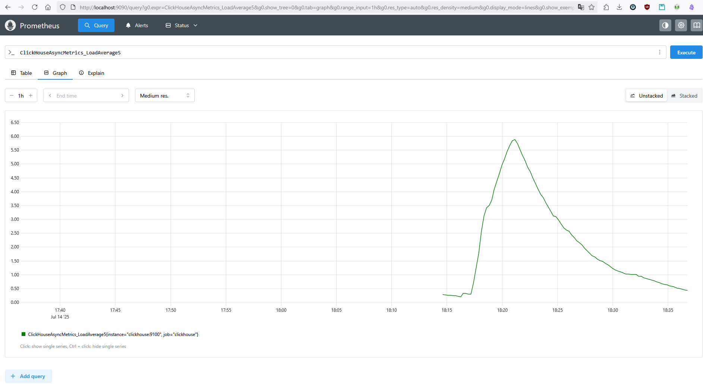

# Мониторинг
## Prometheus и pull метрик
Эндпойнт в кликхаусе с публикацией метрик в формате prometheus описан в [prometheus.xml](../infrastructure/clickhouse/config.d/prometheus.xml).
Prometheus поднят как контейнер docker, см. сервис prometheus в [docker-compose.yml](../infrastructure/docker-compose.yml).
Конфигурация прома в виде одного таргета описана в [prometheus.yml](../infrastructure/prometheus/prometheus.yml).
Результат можно посмотреть в UI самого прометеуса ([http://localhost:9090/](http://localhost:9090/)):


## Задание со звездочкой
Конфигурация описана аналогично ДЗ №9 [homework-9.md](./homework-9.md#добавьте-2-реплики)
В [docker-compose.yml](../infrastructure/docker-compose.yml) это сервис clickhouse_replica. Конфигурация для каждого из инстансов разнесена по разным каталогам:
- [clickhouse](../infrastructure/clickhouse/)
- [clickhouse-replica](../infrastructure/clickhouse-replica/)

Статус кластера:
```sql
clickhouse :) SELECT
    shard_num,
    replica_num,
    host_name,
    host_address,
    port,
    is_local
FROM system.clusters
WHERE cluster = 'otus';

   ┌─shard_num─┬─replica_num─┬─host_name──────────┬─host_address─┬─port─┬─is_local─┐
1. │         1 │           1 │ clickhouse         │ 172.18.0.3   │ 9000 │        1 │
2. │         1 │           2 │ clickhouse-replica │ 172.18.0.7   │ 9000 │        0 │
   └───────────┴─────────────┴────────────────────┴──────────────┴──────┴──────────┘

2 rows in set. Elapsed: 0.002 sec. 

clickhouse :) 
```
Манипуляции с таблицами:
```sql
clickhouse :) CREATE DATABASE logs ON CLUSTER 'otus';

   ┌─host───────────────┬─port─┬─status─┬─error─┬─num_hosts_remaining─┬─num_hosts_active─┐
1. │ clickhouse         │ 9000 │      0 │       │                   1 │                0 │
2. │ clickhouse-replica │ 9000 │      0 │       │                   0 │                0 │
   └────────────────────┴──────┴────────┴───────┴─────────────────────┴──────────────────┘

2 rows in set. Elapsed: 0.071 sec. 

clickhouse :) CREATE TABLE logs.null_engine ON CLUSTER 'otus' (
  timestamp Date,
  message String)
ENGINE=Null;

   ┌─host───────────────┬─port─┬─status─┬─error─┬─num_hosts_remaining─┬─num_hosts_active─┐
1. │ clickhouse         │ 9000 │      0 │       │                   1 │                0 │
2. │ clickhouse-replica │ 9000 │      0 │       │                   0 │                0 │
   └────────────────────┴──────┴────────┴───────┴─────────────────────┴──────────────────┘

2 rows in set. Elapsed: 0.064 sec. 

clickhouse :) CREATE TABLE logs.replicated_engine ON CLUSTER 'otus' (
  timestamp Date,
  message String,
  replica String)
ENGINE=ReplicatedMergeTree('/clickhouse/tables/logs.replicated_engine/{shard}', '{replica}')
ORDER BY timestamp;

   ┌─host───────────────┬─port─┬─status─┬─error─┬─num_hosts_remaining─┬─num_hosts_active─┐
1. │ clickhouse         │ 9000 │      0 │       │                   1 │                0 │
2. │ clickhouse-replica │ 9000 │      0 │       │                   0 │                0 │
   └────────────────────┴──────┴────────┴───────┴─────────────────────┴──────────────────┘

2 rows in set. Elapsed: 0.071 sec. 

clickhouse :) CREATE MATERIALIZED VIEW logs.materialized_view ON CLUSTER 'otus'
TO logs.replicated_engine
AS SELECT
  timestamp,
  message,
  getMacro('replica') AS replica
FROM logs.null_engine;

   ┌─host───────────────┬─port─┬─status─┬─error─┬─num_hosts_remaining─┬─num_hosts_active─┐
1. │ clickhouse         │ 9000 │      0 │       │                   1 │                0 │
2. │ clickhouse-replica │ 9000 │      0 │       │                   0 │                0 │
   └────────────────────┴──────┴────────┴───────┴─────────────────────┴──────────────────┘

2 rows in set. Elapsed: 0.072 sec. 

clickhouse :)
```
Проверка разных реплик:
```bash
ednefed@nfd-vm-ubuntu:/opt/Works/otus/clickhouse$ docker compose -f infrastructure/docker-compose.yml -p otus exec -t clickhouse \
  clickhouse-client -q "INSERT INTO logs.null_engine (timestamp, message) VALUES (today(), 'message one');"
ednefed@nfd-vm-ubuntu:/opt/Works/otus/clickhouse$ docker compose -f infrastructure/docker-compose.yml -p otus exec -t clickhouse \
  clickhouse-client -q "INSERT INTO logs.null_engine (timestamp, message) VALUES (today(), 'message two');"
ednefed@nfd-vm-ubuntu:/opt/Works/otus/clickhouse$ docker compose -f infrastructure/docker-compose.yml -p otus exec -t clickhouse \
  clickhouse-client -q "INSERT INTO logs.null_engine (timestamp, message) VALUES (today(), 'message three');"
ednefed@nfd-vm-ubuntu:/opt/Works/otus/clickhouse$ docker compose -f infrastructure/docker-compose.yml -p otus exec -t clickhouse_replica \
  clickhouse-client -q "INSERT INTO logs.null_engine (timestamp, message) VALUES (today(), 'message four');"
ednefed@nfd-vm-ubuntu:/opt/Works/otus/clickhouse$ docker compose -f infrastructure/docker-compose.yml -p otus exec -t clickhouse_replica \
  clickhouse-client -q "INSERT INTO logs.null_engine (timestamp, message) VALUES (today(), 'message five');"
ednefed@nfd-vm-ubuntu:/opt/Works/otus/clickhouse$ docker compose -f infrastructure/docker-compose.yml -p otus exec -t clickhouse_replica \
  clickhouse-client -q "INSERT INTO logs.null_engine (timestamp, message) VALUES (today(), 'message six');"
ednefed@nfd-vm-ubuntu:/opt/Works/otus/clickhouse$ docker compose -f infrastructure/docker-compose.yml -p otus exec -t clickhouse \
  clickhouse-client -q "SELECT * FROM logs.replicated_engine;"
2025-07-14      message one     1
2025-07-14      message two     1
2025-07-14      message three   1
2025-07-14      message four    2
2025-07-14      message five    2
2025-07-14      message six     2
ednefed@nfd-vm-ubuntu:/opt/Works/otus/clickhouse$
ednefed@nfd-vm-ubuntu:/opt/Works/otus/clickhouse$ docker compose -f infrastructure/docker-compose.yml -p otus exec -t clickhouse_replica \
  clickhouse-client -q "SELECT * FROM logs.replicated_engine;"
2025-07-14      message one     1
2025-07-14      message two     1
2025-07-14      message three   1
2025-07-14      message four    2
2025-07-14      message five    2
2025-07-14      message six     2
ednefed@nfd-vm-ubuntu:/opt/Works/otus/clickhouse$ 
```
Данные отреплицировались между репликами, записав в поле replica соответствующий номер инстанса, где была произведена вставка.
DDL объектов:
```sql
clickhouse :) SHOW CREATE TABLE logs.null_engine;

   ┌─statement─────────────────────┐
1. │ CREATE TABLE logs.null_engine↴│
   │↳(                            ↴│
   │↳    `timestamp` Date,        ↴│
   │↳    `message` String         ↴│
   │↳)                            ↴│
   │↳ENGINE = Null                 │
   └───────────────────────────────┘

1 row in set. Elapsed: 0.001 sec. 

clickhouse :) SHOW CREATE TABLE logs.replicated_engine;

   ┌─statement──────────────────────────────────────────────────────────────────────────────────────┐
1. │ CREATE TABLE logs.replicated_engine                                                           ↴│
   │↳(                                                                                             ↴│
   │↳    `timestamp` Date,                                                                         ↴│
   │↳    `message` String,                                                                         ↴│
   │↳    `replica` String                                                                          ↴│
   │↳)                                                                                             ↴│
   │↳ENGINE = ReplicatedMergeTree('/clickhouse/tables/logs.replicated_engine/{shard}', '{replica}')↴│
   │↳ORDER BY timestamp                                                                            ↴│
   │↳SETTINGS index_granularity = 8192                                                              │
   └────────────────────────────────────────────────────────────────────────────────────────────────┘

1 row in set. Elapsed: 0.001 sec. 

clickhouse :) SHOW CREATE VIEW logs.materialized_view;

   ┌─statement─────────────────────────────────────────────────────────────────┐
1. │ CREATE MATERIALIZED VIEW logs.materialized_view TO logs.replicated_engine↴│
   │↳(                                                                        ↴│
   │↳    `timestamp` Date,                                                    ↴│
   │↳    `message` String,                                                    ↴│
   │↳    `replica` String                                                     ↴│
   │↳)                                                                        ↴│
   │↳AS SELECT                                                                ↴│
   │↳    timestamp,                                                           ↴│
   │↳    message,                                                             ↴│
   │↳    getMacro('replica') AS replica                                       ↴│
   │↳FROM logs.null_engine                                                     │
   └───────────────────────────────────────────────────────────────────────────┘

1 row in set. Elapsed: 0.001 sec. 

clickhouse :) 
```
