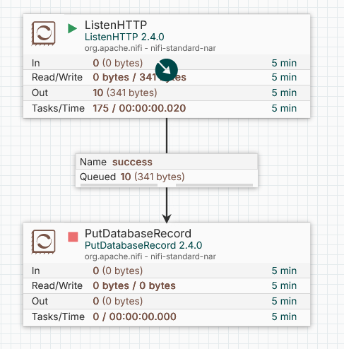

# Загрузка данных в ClickHouse
В качетсве оркестратора использую Apache NiFi, сервис nifi в [docker-compose.yml](../infrastructure/docker-compose.yml).
В nifi будет два процессора: ListenHTTP и PutDatabaseRecord. ListenHTTP по сути предоставляет HTTP эндпойнт на определённом порту. PutDatabaseRecord кладёт записи, приходящие на вход, в указанную таблицу БД. Для подключения импользуется JDBC, поэтому надо скачать [официальный драйвер](https://clickhouse.com/docs/interfaces/jdbc) и положить его в контейнер с nifi:
```bash
ednefed@nfd-vm-ubuntu:/opt/Works/otus/clickhouse$ docker cp /opt/homework/software/clickhouse-jdbc-0.7.1-all.jar otus-nifi-1:/opt/
Successfully copied 8.1MB to otus-nifi-1:/opt/
ednefed@nfd-vm-ubuntu:/opt/Works/otus/clickhouse$ docker exec -tu 0 otus-nifi-1 chmod 0644 /opt/clickhouse-jdbc-0.7.1-all.jar
ednefed@nfd-vm-ubuntu:/opt/Works/otus/clickhouse$ 
```
Далее, настроим процессоры. PutDatabaseRecord потрубются два Controller Service объекта: Reader и ConnectionPool, отвечющие за чтения входных данных и коннект к базе.
Для подключения нужно создать типа DPCPConnectionPool, описывающий коннект к БД:


В качеств ридера будет JsonTreeReader:


И сам процессор:


Далее создадим в базе простую таблицу:
```sql
clickhouse :) CREATE TABLE nifi (id UInt32, message String) ENGINE=MergeTree ORDER BY id;

Ok.

0 rows in set. Elapsed: 0.005 sec. 

clickhouse :) 
```

Включим ListenHTTP и отправим 10 сообещний в него:
```bash
ednefed@nfd-vm-ubuntu:/opt/Works/otus/clickhouse$ for i in {1..10}; do
  curl --location 'http://localhost:8081/api' --data '{"id": '$i', "message": "'$(tr -dc A-Za-z0-9 < /dev/urandom | head -c 10)'"}'
done
ednefed@nfd-vm-ubuntu:/opt/Works/otus/clickhouse$ 
```
В nifi видно 10 обработанных записей, которые одижают в очереди, т.к PutDatabaseRecord пока выключен. 



Включим PutDatabaseRecord. Он успешно обработает 10 записей.


Псомотрим в базу:
```sql
clickhouse :) select * from nifi;

    ┌─id─┬─message────┐
 1. │  1 │ GmllVG71uy │
 2. │  2 │ TbPIcYyvLF │
 3. │  3 │ i2nJIK8iI2 │
 4. │  4 │ cHO8iwWWi4 │
 5. │  5 │ atX4WMS4O2 │
 6. │  6 │ 60DIQjEB85 │
 7. │  7 │ Be3vluplz1 │
 8. │  8 │ hZyqPG1LZY │
 9. │  9 │ kRYqzJMU0X │
10. │ 10 │ YrylIVy3e4 │
    └────┴────────────┘

10 rows in set. Elapsed: 0.001 sec. 

clickhouse :) 
```
10 записей внутри. Итоговый Flow экспортирован в [NiFi_Flow.json](../results/homework-16/NiFi_Flow.json).
