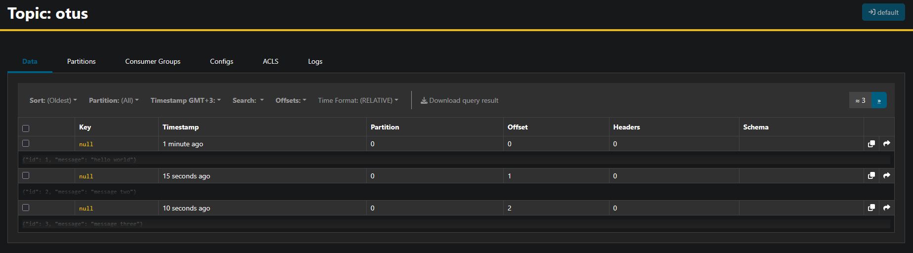

# Интеграция с Apache Kafka
Кафка запущена как сервис kafka через [docker-compose.yml](../infrastructure/docker-compose.yml). Дополнительно развёрнут удобный UI как сервис akhq там же.
Создадим в кафке топик otus, запишем туда несколько сообщений:



Создадим необходимые объекты в базе: таблицу с KafkaEngine, таблицу MergeTree, матвью:
```sql
clickhouse :) CREATE TABLE kafka_source (
  id UInt32,
  message String) 
ENGINE = Kafka() 
SETTINGS 
  kafka_broker_list = 'kafka:9092',
  kafka_topic_list = 'otus',
  kafka_group_name = 'clickhouse',
  kafka_format = 'JSONEachRow';

Ok.

0 rows in set. Elapsed: 0.004 sec. 

clickhouse :) CREATE TABLE kafka_target; (id UInt32, message String) ENGINE=MergeTree ORDER BY id;

Ok.

0 rows in set. Elapsed: 0.006 sec. 

clickhouse :) CREATE MATERIALIZED VIEW kafka_consumer TO kafka_target AS SELECT id, message FROM kafka_source;

Ok.

0 rows in set. Elapsed: 0.013 sec. 

clickhouse :) 
```

Кликхаус сразу начнёт вытягивать данные из топика. Проверим в AKHQ:


Лаг консьюмер группы нулевой, значит все данные должны были попасть в таблицу. Проверим:
```sql
clickhouse :) SELECT * FROM kafka_target;

   ┌─id─┬─message───────┐
1. │  1 │ hello world   │
2. │  2 │ message two   │
3. │  3 │ message three │
   └────┴───────────────┘

3 rows in set. Elapsed: 0.002 sec. 

clickhouse :) 
```

Всё на месте.
