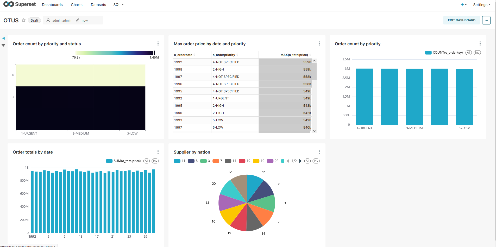

# Визуализация данных
Настраиваем суперсет:
```bash
superset@29be0e0ca46b:/app$ superset fab create-admin --username admin --firstname admin --lastname admin --email admin@localhost --password admin 
...
Recognized Database Authentications.
Admin User admin created.
superset@29be0e0ca46b:/app$ superset db upgrade
WARNI [alembic.env] SQLite Database support for metadata databases will         be removed in a future version of Superset.
INFO  [alembic.env] Starting the migration scripts.
...
INFO  [alembic.env] Migration scripts completed. Duration: 00:00:03
superset@29be0e0ca46b:/app$ superset init
2025-07-20 19:47:49,926:INFO:superset.security.manager:Syncing role definition
2025-07-20 19:47:50,023:INFO:superset.security.manager:Syncing Admin perms
2025-07-20 19:47:50,025:INFO:superset.security.manager:Syncing Alpha perms
2025-07-20 19:47:50,106:INFO:superset.security.manager:Syncing Gamma perms
2025-07-20 19:47:50,185:INFO:superset.security.manager:Syncing sql_lab perms
2025-07-20 19:47:50,251:INFO:superset.security.manager:Fetching a set of all perms to lookup which ones are missing
2025-07-20 19:47:50,254:INFO:superset.security.manager:Creating missing datasource permissions.
2025-07-20 19:47:50,259:INFO:superset.security.manager:Creating missing database permissions.
2025-07-20 19:47:50,260:INFO:superset.security.manager:Cleaning faulty perms
superset@29be0e0ca46b:/app$ pip install clickhouse-connect
Defaulting to user installation because normal site-packages is not writeable
Collecting clickhouse-connect
  Downloading clickhouse_connect-0.8.18-cp310-cp310-manylinux_2_17_x86_64.manylinux2014_x86_64.whl.metadata (3.4 kB)
Requirement already satisfied: certifi in /usr/local/lib/python3.10/site-packages (from clickhouse-connect) (2024.2.2)
Requirement already satisfied: urllib3>=1.26 in /usr/local/lib/python3.10/site-packages (from clickhouse-connect) (1.26.18)
Requirement already satisfied: pytz in /usr/local/lib/python3.10/site-packages (from clickhouse-connect) (2024.1)
Requirement already satisfied: zstandard in /usr/local/lib/python3.10/site-packages (from clickhouse-connect) (0.22.0)
Collecting lz4 (from clickhouse-connect)
  Downloading lz4-4.4.4-cp310-cp310-manylinux_2_17_x86_64.manylinux2014_x86_64.whl.metadata (3.8 kB)
Downloading clickhouse_connect-0.8.18-cp310-cp310-manylinux_2_17_x86_64.manylinux2014_x86_64.whl (979 kB)
   ━━━━━━━━━━━━━━━━━━━━━━━━━━━━━━━━━━━━━━━━ 979.6/979.6 kB 1.2 MB/s eta 0:00:00
Downloading lz4-4.4.4-cp310-cp310-manylinux_2_17_x86_64.manylinux2014_x86_64.whl (1.3 MB)
   ━━━━━━━━━━━━━━━━━━━━━━━━━━━━━━━━━━━━━━━━ 1.3/1.3 MB 2.2 MB/s eta 0:00:00
Installing collected packages: lz4, clickhouse-connect
Successfully installed clickhouse-connect-0.8.18 lz4-4.4.4
superset@f25002f2dfb3:/app$
```

В качестве источника данных возьмём уже имеющуюся базу TPC-H и создадим 5 каких-то чартов:


