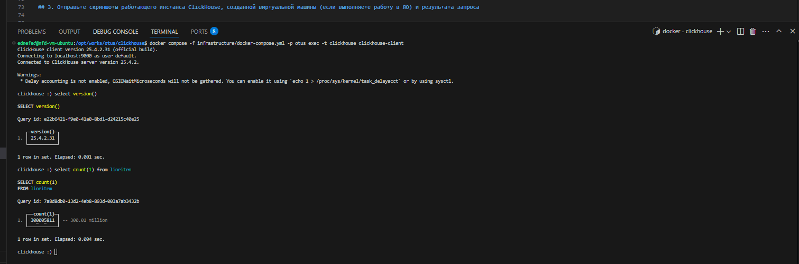

# Установка ClickHouse
## 1. Установите ClickHouse
ClickHouse был запущен в контейнере Docker (мне крайне лень вне работы заниматься с установкой ванильного), используя [docker-compose](../infrastructure/docker-compose.yml) и официальный образ clickhouse:25.4.
```bash
ednefed@nfd-vm-ubuntu:/opt/works/otus/clickhouse$ docker compose -f infrastructure/docker-compose.yml -p otus up -d
[+] Running 3/3
 ✔ Network otus_default         Created 0.1s 
 ✔ Volume "otus_data"           Created 0.0s 
 ✔ Container otus-clickhouse-1  Started 0.2s 
ednefed@nfd-vm-ubuntu:/opt/works/otus/clickhouse$ docker compose -f infrastructure/docker-compose.yml -p otus ps
NAME                IMAGE                               COMMAND             SERVICE             CREATED             STATUS              PORTS
otus-clickhouse-1   docker.io/library/clickhouse:25.4   "/entrypoint.sh"    clickhouse          6 seconds ago       Up 6 seconds        0.0.0.0:8123->8123/tcp, :::8123->8123/tcp, 0.0.0.0:9000->9000/tcp, :::9000->9000/tcp, 9009/tcp
ednefed@nfd-vm-ubuntu:/opt/works/otus/clickhouse$ docker compose -f infrastructure/docker-compose.yml -p otus exec -t clickhouse clickhouse-client -q 'select version()'
25.4.2.31
ednefed@nfd-vm-ubuntu:/opt/works/otus/clickhouse$
```

## 2. Загрузите тестовый датасет и выполните выборку из таблицы
Я использовал официальный датасет [TPC-H](https://clickhouse.com/docs/getting-started/example-datasets/tpch) ввиду предлагаемого удобного генератора исходных данных.
Сгенерировал данные:
```bash
ednefed@nfd-vm-ubuntu:/opt/works/git/github.com$ git clone https://github.com/gregrahn/tpch-kit.git
Cloning into 'tpch-kit'...
...
ednefed@nfd-vm-ubuntu:/opt/works/git/github.com$ cd tpch-kit/dbgen
ednefed@nfd-vm-ubuntu:/opt/works/git/github.com/tpch-kit/dbgen$ make
...
ednefed@nfd-vm-ubuntu:/opt/works/git/github.com/tpch-kit/dbgen$ ./dbgen -s 50
TPC-H Population Generator (Version 2.17.3)
Copyright Transaction Processing Performance Council 1994 - 2010
...
ednefed@nfd-vm-ubuntu:/opt/works/git/github.com/tpch-kit/dbgen$ ls -lh *.tbl
-rwxrwx--- 1 root vboxsf 1.2G May 20 03:39 customer.tbl
-rwxrwx--- 1 root vboxsf  37G May 20 03:39 lineitem.tbl
-rwxrwx--- 1 root vboxsf 2.2K May 20 03:39 nation.tbl
-rwxrwx--- 1 root vboxsf 8.2G May 20 03:39 orders.tbl
-rwxrwx--- 1 root vboxsf 5.7G May 20 03:39 partsupp.tbl
-rwxrwx--- 1 root vboxsf 1.2G May 20 03:39 part.tbl
-rwxrwx--- 1 root vboxsf  384 May 20 03:39 region.tbl
-rwxrwx--- 1 root vboxsf  68M May 20 03:39 supplier.tbl
ednefed@nfd-vm-ubuntu:/opt/works/git/github.com/tpch-kit/dbgen$
```

Общий объём составил примерно 50 ГБ.
Создал таблицы:
```bash
ednefed@nfd-vm-ubuntu:/opt/works/otus/clickhouse$ docker compose -f infrastructure/docker-compose.yml -p otus exec -t clickhouse clickhouse-client -q "SHOW TABLES FROM default"
customer
lineitem
nation
orders
part
partsupp
region
supplier
ednefed@nfd-vm-ubuntu:/opt/works/otus/clickhouse$
```

И загрузил в них данные:
```bash
ednefed@nfd-vm-ubuntu:/opt/works/otus/clickhouse$ docker compose -f infrastructure/docker-compose.yml -p otus exec -t clickhouse bash
root@clickhouse:/# clickhouse-client --format_csv_delimiter '|' --query "INSERT INTO nation FORMAT CSV" < /opt/works/git/github.com/tpch-kit/dbgen/nation.tbl
root@clickhouse:/# clickhouse-client --format_csv_delimiter '|' --query "INSERT INTO region FORMAT CSV" < /opt/works/git/github.com/tpch-kit/dbgen/region.tbl
root@clickhouse:/# clickhouse-client --format_csv_delimiter '|' --query "INSERT INTO part FORMAT CSV" < /opt/works/git/github.com/tpch-kit/dbgen/part.tbl
root@clickhouse:/# clickhouse-client --format_csv_delimiter '|' --query "INSERT INTO supplier FORMAT CSV" < /opt/works/git/github.com/tpch-kit/dbgen/supplier.tbl
root@clickhouse:/# clickhouse-client --format_csv_delimiter '|' --query "INSERT INTO partsupp FORMAT CSV" < /opt/works/git/github.com/tpch-kit/dbgen/partsupp.tbl
root@clickhouse:/# clickhouse-client --format_csv_delimiter '|' --query "INSERT INTO customer FORMAT CSV" < /opt/works/git/github.com/tpch-kit/dbgen/customer.tbl
root@clickhouse:/# clickhouse-client --format_csv_delimiter '|' --query "INSERT INTO orders FORMAT CSV" < /opt/works/git/github.com/tpch-kit/dbgen/orders.tbl
root@clickhouse:/# clickhouse-client --format_csv_delimiter '|' --query "INSERT INTO lineitem FORMAT CSV" < /opt/works/git/github.com/tpch-kit/dbgen/lineitem.tbl
ednefed@nfd-vm-ubuntu:/opt/works/otus/clickhouse$ 
```

## 3. Отправьте скриншоты работающего инстанса ClickHouse, созданной виртуальной машины (если выполняете работу в ЯО) и результата запроса
Вот же он: 
В самой большой таблице базы 300 млн строк.

## 4. Проведите тестирование производительности и сохраните результаты
Параметры хоста: 12 ЦПУ, 32 ГБ ОЗУ.

Тестирование производительности буду проводить с помощью встроенной утилиты clickhouse-benchmark с параметром в 10 итераций:
```bash
ednefed@nfd-vm-ubuntu:/opt/works/otus/clickhouse$ docker compose -f infrastructure/docker-compose.yml -p otus exec -t clickhouse clickhouse-benchmark -q 'select s.s_nationkey, count(1) from lineitem li left join supplier s on li.l_suppkey = s.s_suppkey group by s.s_nationkey' -i 10
...
Queries executed: 10.

localhost:9000, queries: 10, QPS: 0.440, RPS: 132165074.703, MiB/s: 505.009, result RPS: 10.995, result MiB/s: 0.000.

0%              2.207 sec.
10%             2.213 sec.
20%             2.225 sec.
30%             2.227 sec.
40%             2.245 sec.
50%             2.272 sec.
60%             2.272 sec.
70%             2.276 sec.
80%             2.286 sec.
90%             2.320 sec.
95%             2.348 sec.
99%             2.348 sec.
99.9%           2.348 sec.
99.99%          2.348 sec.
```

## Изучите конфигурационные файлы базы данных + Настройте систему с учётом характеристик вашей ОС, оптимизируйте параметры и выполните повторное тестирование
В рамках погружения в конфигурацию инстанса и для демонстрации производительности БД при разных имеющихся ресурсах, для начала, я ограничил объём доступной памяти для запросов на уровне пользователя через параметр max_memory_usage:
```bash
ednefed@nfd-vm-ubuntu:/opt/works/otus/clickhouse$ docker compose -f infrastructure/docker-compose.yml -p otus exec -t clickhouse cat /etc/clickhouse-server/users.d/memory-constraint.xml
<clickhouse>
  <profiles>
    <default>
      <max_memory_usage>134217728</max_memory_usage>
    </default>
  </profiles>
</clickhouse>
ednefed@nfd-vm-ubuntu:/opt/works/otus/clickhouse$ docker compose -f infrastructure/docker-compose.yml -p otus exec -t clickhouse clickhouse-client -q "SELECT getSetting('max_memory_usage')"
134217728
ednefed@nfd-vm-ubuntu:/opt/works/otus/clickhouse$ 
```

Затем повторил clickhouse-benchmark:
```bash
ednefed@nfd-vm-ubuntu:/opt/works/otus/clickhouse$ docker compose -f infrastructure/docker-compose.yml -p otus exec -t clickhouse clickhouse-benchmark -q 'select s.s_nationkey, count(1) from lineitem li left join supplier s on li.l_suppkey = s.s_suppkey group by s.s_nationkey' -i 10
...
Queries executed: 10.

localhost:9000, queries: 10, QPS: 0.434, RPS: 130384157.899, MiB/s: 498.204, result RPS: 10.847, result MiB/s: 0.000.

0%              2.262 sec.
10%             2.263 sec.
20%             2.271 sec.
30%             2.284 sec.
40%             2.288 sec.
50%             2.292 sec.
60%             2.292 sec.
70%             2.299 sec.
80%             2.301 sec.
90%             2.315 sec.
95%             2.354 sec.
99%             2.354 sec.
99.9%           2.354 sec.
99.99%          2.354 sec.
```

Ещё уменьшил max_memory_usage и повторил бенчмарк, на что база ответила эксепшном о недостатке памяти на запрос:
```bash
ednefed@nfd-vm-ubuntu:/opt/works/otus/clickhouse$ docker compose -f infrastructure/docker-compose.yml -p otus exec -t clickhouse clickhouse-client -q "SELECT getSetting('max_memory_usage')"
67108864
ednefed@nfd-vm-ubuntu:/opt/works/otus/clickhouse$ docker compose -f infrastructure/docker-compose.yml -p otus exec -t clickhouse clickhouse-benchmark -q 'select s.s_nationkey, count(1) from lineitem li left join supplier s on li.l_suppkey = s.s_suppkey group by s.s_nationkey' -i 10 
Loaded 1 queries.
DB::Exception: Received from localhost:9000. DB::Exception: Query memory limit exceeded: would use 66.62 MiB (attempt to allocate chunk of 5.27 MiB bytes), maximum: 64.00 MiB.: While executing JoiningTransform. Stack trace:
...
ednefed@nfd-vm-ubuntu:/opt/works/otus/clickhouse$ 
```

Далее, я вместо ограничения памяти я ограничил доступные ресурсы ЦПУ:
```bash
ednefed@nfd-vm-ubuntu:/opt/works/otus/clickhouse$ docker compose -f infrastructure/docker-compose.yml -p otus exec -t clickhouse cat /etc/clickhouse-server/users.d/cpu-constraint.xml
<clickhouse>
  <profiles>
    <default>
      <max_threads>1</max_threads>
    </default>
  </profiles>
</clickhouse>
ednefed@nfd-vm-ubuntu:/opt/works/otus/clickhouse$ docker compose -f infrastructure/docker-compose.yml -p otus exec -t clickhouse clickhouse-client -q "SELECT getSetting('max_threads')"
1
ednefed@nfd-vm-ubuntu:/opt/works/otus/clickhouse$ docker compose -f infrastructure/docker-compose.yml -p otus exec -t clickhouse clickhouse-client -q "SELECT getSetting('max_memory_usage')"
0
ednefed@nfd-vm-ubuntu:/opt/works/otus/clickhouse$
```

Затем ещё раз повторил clickhouse-benchmark:
```bash
ednefed@nfd-vm-ubuntu:/opt/works/otus/clickhouse$ docker compose -f infrastructure/docker-compose.yml -p otus exec -t clickhouse clickhouse-benchmark -q 'select s.s_nationkey, count(1) from lineitem li left join supplier s on li.l_suppkey = s.s_suppkey group by s.s_nationkey' -i 10
...
Queries executed: 10.

localhost:9000, queries: 10, QPS: 0.059, RPS: 17680301.022, MiB/s: 67.557, result RPS: 1.471, result MiB/s: 0.000.

0%              16.249 sec.
10%             16.600 sec.
20%             16.638 sec.
30%             16.679 sec.
40%             16.788 sec.
50%             16.926 sec.
60%             16.926 sec.
70%             17.221 sec.
80%             17.384 sec.
90%             17.632 sec.
95%             17.736 sec.
99%             17.736 sec.
99.9%           17.736 sec.
99.99%          17.736 sec.
```

## Подготовьте отчёт о приросте/изменении производительности системы на основе проведённых настроек
Из проведённых тестов можно сделать вывод, что объём памяти оказывает незначительное влияние на производительность запросов -- если памяти достаточно, то запрос точно будет успешным. А вот число доступных потоков, наоборот, сильно влияет на производительность -- запрос в 1 поток выполнялся примерно в 7 раз дольше.
